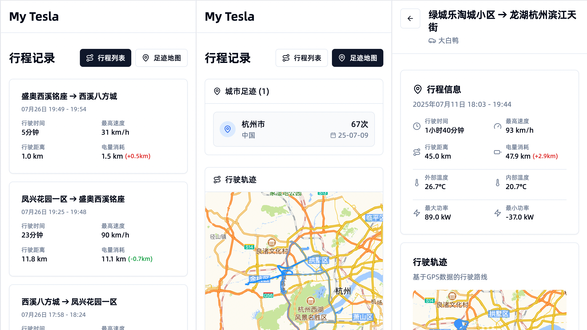

# Tesla Dashboard

[](https://hub.docker.com/r/hushaopeng/tesla-dashboard-lite)
[](LICENSE)

Tesla Dashboard 是一个现代化的 Tesla 仪表板，为 TeslaMate 用户提供更直观、更好用的可视化体验。与 TeslaMate Grafana 面板相比，我们专注于用户体验和实用性，使用现代化UI展示数据，结合高德API优化行程展示。



## 特性

### 与 TeslaMate Grafana 的区别

| 特性 | TeslaMate Grafana | Tesla Dashboard |
|------|------------------|-----------------|
| 定位 | 专业通用的数据可视化平台 | 聚焦于日常使用和易用性 |
| 用户体验 | 功能强大但学习成本高 | 简洁直观，开箱即用 |
| 行程标题 | 基础地址信息 | 高德地图API智能地址解析 |
| 轨迹展示 | 基础地图显示 | 高德地图深度集成，更清晰的轨迹展示 |
| 移动端适配 | 基础响应式 | 专为移动端优化的UI |
| 数据展示 | 图表为主 | 图表+地图结合，信息更丰富 |

### 核心优势

1. **智能地址解析** - 利用高德地图API将GPS坐标转换为详细地址，让行程标题更清晰易懂
2. **优化的轨迹展示** - 基于高德地图的轨迹展示更加清晰，支持缩放和详细查看
3. **移动端优化** - 专为手机使用场景设计，界面简洁直观
4. **轻量级部署** - 镜像大小仅150MB左右，部署快速
5. **中文友好** - 完全中文化界面，符合国内用户使用习惯

## 快速开始

### 使用 Docker Compose 一键部署（推荐）

创建 `docker-compose.yml` 文件，仅需要调整NEXT_PUBLIC_AMAP_KEY（高德开放API的密钥），申请可参考[高德开放平台](https://lbs.amap.com/api/javascript-api-v2/prerequisites)：

```yaml
version: "3"

services:
  teslamate:
    image: teslamate/teslamate:latest
    restart: always
    environment:
      - ENCRYPTION_KEY=change_this_key
      - DATABASE_USER=teslamate
      - DATABASE_PASS=123456
      - DATABASE_NAME=teslamate
      - DATABASE_HOST=database
      - MQTT_HOST=mosquitto
      - TZ=Asia/Shanghai
    ports:
      - 4000:4000
    volumes:
      - ./import:/opt/app/import
    cap_drop:
      - all

  database:
    image: postgres:16.7
    restart: always
    environment:
      - POSTGRES_USER=teslamate
      - POSTGRES_PASSWORD=123456
      - POSTGRES_DB=teslamate
    volumes:
      - teslamate-db:/var/lib/postgresql/data
      - ./config/postgresql.conf:/etc/postgresql/postgresql.conf
      - ./config/pg_hba.conf:/etc/postgresql/pg_hba.conf
    command: ["postgres", "-c", "config_file=/etc/postgresql/postgresql.conf"]
    
  grafana:
    image: grafana/grafana:latest
    restart: always
    environment:
      - DATABASE_USER=teslamate
      - DATABASE_PASS=123456
      - DATABASE_NAME=teslamate
      - DATABASE_HOST=database
    ports:
      - 3000:3000
    volumes:
      - teslamate-grafana-data:/var/lib/grafana

  mosquitto:
    image: eclipse-mosquitto:2
    restart: always
    command: mosquitto -c /mosquitto-no-auth.conf
    volumes:
      - mosquitto-conf:/mosquitto/config
      - mosquitto-data:/mosquitto/data

  tesla-dashboard:
    image: hushaopeng/tesla-dashboard-lite:amd64
    ports:
      - "3333:3333"
    environment:
      - SKIP_DB_CONNECTION=false
      - DB_HOST=database
      - DB_PORT=5432
      - DB_NAME=teslamate
      - DB_USER=teslamate
      - DB_PASSWORD=123456

      # 高德地图 API 配置（请替换为自己的高德API Key）
      - NEXT_PUBLIC_AMAP_KEY=your_amap_api_key_here

      # 时区配置
      - TZ=Asia/Shanghai

volumes:
  teslamate-db:
  teslamate-grafana-data:
  mosquitto-conf:
  mosquitto-data:
```

然后运行：

```bash
# 拉取所有镜像
docker-compose pull
# 部分nas命令为
# docker compose pull

# 启动所有服务
docker-compose up -d
# 部分nas命令为
# docker compose up -d

# 查看日志
docker-compose logs -f
# 部分nas命令为
# docker compose logs -f
```


### 独立部署 Tesla Dashboard

如果你已经有运行中的 TeslaMate 实例，可以直接部署 Tesla Dashboard：

```bash
docker run -d \
  --name tesla-dashboard \
  -p 3333:3333 \
  -e DB_HOST=your_database_host \
  -e DB_PORT=5432 \
  -e DB_NAME=teslamate \
  -e DB_USER=teslamate \
  -e DB_PASSWORD=your_password \
  -e NEXT_PUBLIC_AMAP_KEY=your_amap_api_key \
  hushaopeng/tesla-dashboard-lite:latest
```

## 访问各服务界面

启动服务后，可以通过以下地址访问各个组件：

- **TeslaMate**: http://localhost:4000 - 主要的 Tesla 数据记录和管理界面
- **Grafana**: http://localhost:3000 - 专业的数据可视化面板
- **Tesla Dashboard**: http://localhost:3333 - 现代化的 Tesla 仪表板，专为日常使用优化

默认情况下，所有服务都绑定到本地主机。如果需要从外部网络访问，请相应地调整 docker-compose.yml 文件中的端口映射。

访问 Tesla Dashboard (http://localhost:3333) 开始体验更直观、更好用的 Tesla 数据可视化。

## 技术栈

- **前端框架**: Next.js 14 (App Router)
- **UI组件**: shadcn/ui + Tailwind CSS
- **地图服务**: 高德地图 JavaScript API
- **数据库**: PostgreSQL (TeslaMate)
- **编程语言**: TypeScript

## 开发

```bash
# 克隆项目
git clone https://github.com/yourusername/tesla-dashboard.git
cd tesla-dashboard

# 安装依赖
npm install

# 配置环境变量
cp .env.local.example .env.local
# 编辑 .env.local 文件设置你的配置

# 启动开发服务器
npm run dev
```

## 贡献

欢迎提交 Issue 和 Pull Request 来改进项目。

## 许可证

[MIT License](LICENSE)